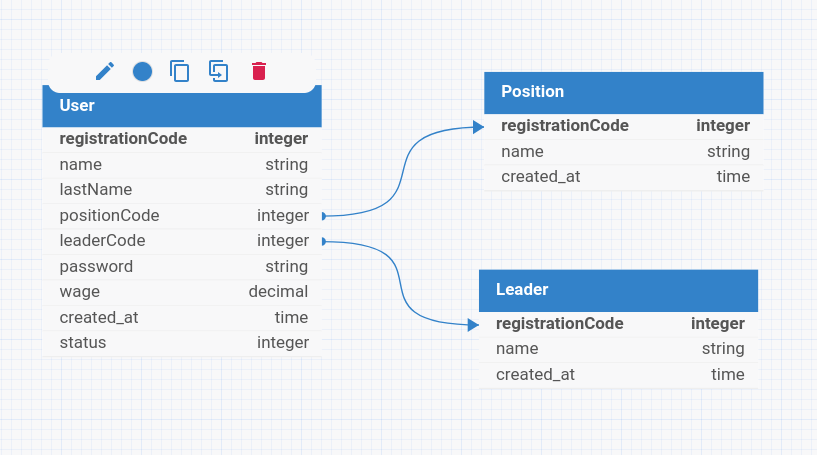

# Desafio Aquarela

Desafio Aquarela is a FastAPI-based web application that provides a RESTful API for managing users, leaders, and positions. The application is structured to handle operations such as creating, updating, retrieving, and deleting entities within its domain.

## Features

- **User Management**: Create, update, retrieve, and delete users. Each user is associated with a position and a leader.
- **Leader Management**: Handle leader entities with functionalities to create, update, retrieve, and delete.
- **Position Management**: Manage positions with operations for creating, updating, retrieving, and deleting.
- **Validation**: Ensure the integrity of data using validators for leaders and positions.

## Technologies Used

- **FastAPI**
- **SQLAlchemy**
- **Alembic**
- **Poetry**
- **Docker**

## Getting Started

### Prerequisites

- Docker and Docker Compose installed on your local machine.

### Installation

1. **Clone the repository**:
   ```bash
   git clone https://github.com/your-username/desafio-aquarela.git
   cd desafio-aquarela
   ```

2. **Build the Docker image and run the container**:
    ```bash
    docker compose up --build
    ```

3. **Access the API**:
   Open your browser or API client and visit [http://localhost:8000/docs](http://localhost:8000/docs).

## API Endpoints

- **Users**:
  - `POST /users`: Create a new user.
  - `GET /users`: Retrieve a list of users.
  - `PUT /users/{registration_code}`: Update a user by registration code.
  - `DELETE /users/{registration_code}`: Delete a user by registration code.

- **Leaders**:
  - `POST /leader`: Create a new leader.
  - `GET /leader`: Retrieve a list of leaders.
  - `PUT /leader/{registration_code}`: Update a leader by registration code.
  - `DELETE /leader/{registration_code}`: Delete a leader by registration code.

- **Positions**:
  - `POST /position`: Create a new position.
  - `GET /position`: Retrieve a list of positions.

## Database


## Running Tests

The test suite is built with pytest and located in the tests directory. To run the tests, follow these steps:

1. Start the Docker containers:

```bash
docker compose up -d
```
2. Wait a few seconds for the containers to fully initialize
3. Execute the test suite:
```bash
docker compose exec app task test
```
4. to see the cover test:
```bash
docker compose exec app task post_test
```
5. Open the index file located in the htmlcov folder

## Potential Enhancements
- Implement robust logging system
- Add monitoring and observability
- Enhance error handling
- Implement authentication
- Add more integration tests
- Improve existing test suite

## License
This project is licensed under the MIT License - see the [LICENSE](LICENSE) file for details.
